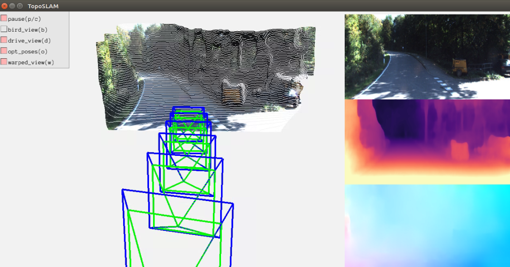

# Introduction

This repo implements a topological SLAM system. 
Deep Visual Odometry ([DF-VO](https://github.com/Huangying-Zhan/DF-VO)) and [Visual Place Recognition](https://github.com/dadung/Visual-Localization-Filtering) are 
combined to form the topological SLAM system.

## Publications

1. [Visual Odometry Revisited: What Should Be Learnt? 
](https://arxiv.org/abs/1909.09803) 

2. [DF-VO: What Should Be Learnt for Visual Odometry?
](https://arxiv.org/abs/2103.00933) 

3. [Scalable Place Recognition Under Appearance Change for Autonomous Driving](https://openaccess.thecvf.com/content_ICCV_2019/html/Doan_Scalable_Place_Recognition_Under_Appearance_Change_for_Autonomous_Driving_ICCV_2019_paper.html)


```
@INPROCEEDINGS{zhan2019dfvo,
  author={H. {Zhan} and C. S. {Weerasekera} and J. -W. {Bian} and I. {Reid}},
  booktitle={2020 IEEE International Conference on Robotics and Automation (ICRA)}, 
  title={Visual Odometry Revisited: What Should Be Learnt?}, 
  year={2020},
  volume={},
  number={},
  pages={4203-4210},
  doi={10.1109/ICRA40945.2020.9197374}}

@misc{zhan2021dfvo,
      title={DF-VO: What Should Be Learnt for Visual Odometry?}, 
      author={Huangying Zhan and Chamara Saroj Weerasekera and Jia-Wang Bian and Ravi Garg and Ian Reid},
      year={2021},
      eprint={2103.00933},
      archivePrefix={arXiv},
      primaryClass={cs.CV}
}

@inproceedings{doan2019scalable,
  title={Scalable place recognition under appearance change for autonomous driving},
  author={Doan, Anh-Dzung and Latif, Yasir and Chin, Tat-Jun and Liu, Yu and Do, Thanh-Toan and Reid, Ian},
  booktitle={Proceedings of the IEEE/CVF International Conference on Computer Vision},
  pages={9319--9328},
  year={2019}
}

```

## Demo:
<a href="https://youtu.be/RhywSFHe5GM">

### Contents
1. [Requirements](#part-1-requirements)
2. [Prepare dataset](#part-2-download-dataset-and-models)
3. [Run example](#part-3-run-example)
4. [Result evaluation](#part-4-result-evaluation)


### Part 1. Requirements

This code was tested with Python 3.6, CUDA 10.0, Ubuntu 16.04, and [PyTorch-1.0](https://pytorch.org/).

We suggest use [Anaconda](https://www.anaconda.com/distribution/) for installing the prerequisites.

```
cd envs
conda env create -f min_requirements.yml -p {ANACONDA_DIR/envs/topo_slam} # install prerequisites
conda activate topo_slam  # activate the environment [topo_slam]
```

### Part 2. Download dataset and models

The main dataset used in this project is [KITTI Driving Dataset](http://www.cvlibs.net/datasets/kitti/eval_odometry.php). After downloaing the dataset, create a softlink in the current repo.
```
ln -s KITTI_ODOMETRY/sequences dataset/kitti_odom/odom_data
```

For our trained models, please visit [here](https://www.dropbox.com/sh/9by21564eb0xloh/AABHFMlWd_ja14c5wU4R1KUua?dl=0) to download the models and save the models into the directory `model_zoo/`.

### Part 3. Run example
``` 
# run default kitti setup
python main.py -d options/examples/default.yml  -r data/kitti_odom
```
More configuration examples can be found in [configuration examples](https://github.com/Huangying-Zhan/DF-VO/tree/master/options/examples).

The result (trajectory pose file) is saved in `result_dir` defined in the configuration file.
Please check [Configuration Documentation](https://df-vo.readthedocs.io/en/latest/rsts/configuration.html) for reference. 

### Part 4. Result evaluation
Please check [here](https://github.com/Huangying-Zhan/DF-VO#part-4-result-evaluation) for evaluating the result.

### License
Please check License file.

### Acknowledgement
Some of the codes were borrowed from the excellent works of [monodepth2](https://github.com/nianticlabs/monodepth2), [LiteFlowNet](https://github.com/twhui/LiteFlowNet) and [pytorch-liteflownet](https://github.com/sniklaus/pytorch-liteflownet). The borrowed files are licensed under their original license respectively.
